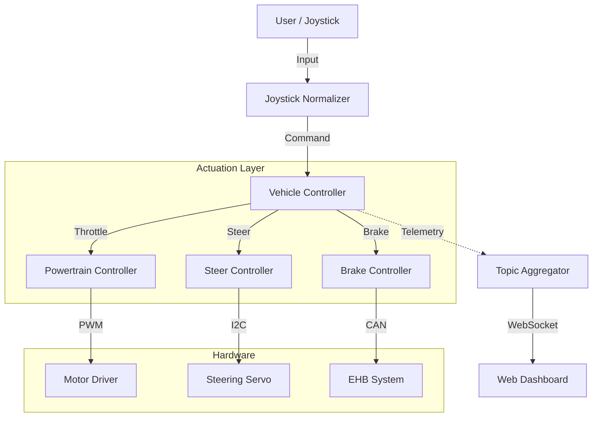

---
hide:
  - navigation ## this removes the navbar for this specific page
---

# Amnis ROS2 documentation

Welcome to the documentation for the **Amnis** vehicle control software. This project utilizes **ROS 2** to provide a robust, modular, and safe control architecture for the Amnis platform.

## Project Overview

The Amnis software stack is designed to bridge the gap between high-level autonomous planning (future) and low-level hardware actuation. It handles:

- **Input Processing**: Normalizing inputs from gamepads, remote controls, or autonomous planners.
- **Vehicle State Management**: Ensuring safe transitions between manual, external, and emergency states.
- **Hardware Abstraction**: Interfacing with CAN bus brakes, PWM motors, and I2C steering actuators.
- **Real-time Monitoring**: Streaming telemetry to a web-based dashboard.

## System Architecture

The system follows a hierarchical control architecture:

## Documentation Sections

### **Nodes**

Detailed API documentation for every ROS 2 node in the system, including parameters, subscribed topics, and published topics. (see [Nodes Overview](nodes/overview.md))

### **Topics**

Definitions of custom ROS 2 messages used for inter-node communication. (see [Topics Overview](topics/overview.md))

### **Development**

Guides for setting up your development environment, building the workspace, and deploying to the vehicle.

- [Setup Guide](development/setup.md)
- [Launch Configuration](development/launch_file.md)
- [Dashboard](development/dashboard.md)
