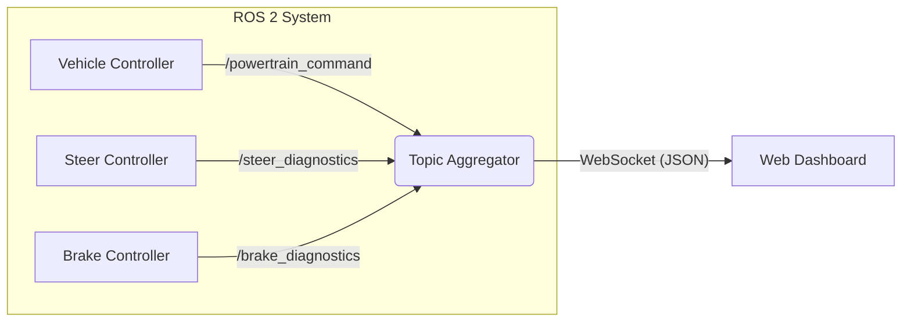

# Topic Aggregator Node

**Node Name:** `topic_aggregator`

The Topic Aggregator node acts as a bridge between the ROS 2 system and the web-based dashboard. It discovers active topics, subscribes to them dynamically, and streams their data to connected WebSocket clients (like the [Dashboard](../development/dashboard.md)).

## Overview

This node is designed to provide a lightweight data layer for the frontend without requiring the browser to speak ROS 2 directly (e.g., via `rosbridge_suite`). It simplifies the architecture by handling the ROS-to-JSON conversion on the backend.

## Responsibilities

1.  **Topic Discovery**: Periodically scans the ROS graph to find new topics.
2.  **Dynamic Subscription**: Automatically subscribes to discovered topics (filtering out ignored ones).
3.  **Data Serialization**: Converts ROS messages into JSON-friendly formats.
    - Handles standard types (int, float, string).
    - Base64 encodes binary data.
4.  **WebSocket Streaming**: Maintains a WebSocket server to push updates to the [Dashboard](../development/dashboard.md).
5.  **Throttling**: Limits the update rate to prevent flooding the frontend.

## Parameters

| Parameter               | Type       | Default                            | Description                                       |
| :---------------------- | :--------- | :--------------------------------- | :------------------------------------------------ |
| `websocket_host`        | `string`   | `'0.0.0.0'`                        | Host interface to bind the WebSocket server to.   |
| `websocket_port`        | `int`      | `8765`                             | Port for the WebSocket server.                    |
| `update_frequency_hz`   | `double`   | `0.5`                              | Frequency at which updates are pushed to clients. |
| `topic_poll_interval`   | `double`   | `2.0`                              | How often (in seconds) to scan for new topics.    |
| `ignored_topics`        | `string[]` | `['/parameter_events', '/rosout']` | List of topics to exclude from aggregation.       |
| `include_hidden_topics` | `bool`     | `False`                            | Whether to include hidden ROS topics.             |

## Architecture

