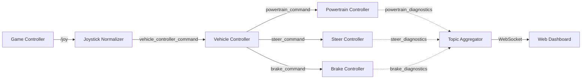

# Topics Overview

This section documents the custom ROS 2 messages and topics used in the Amnis S7 system.

## Topic Graph

The following diagram illustrates the flow of data between the nodes in the system.

## Custom Messages

The `amnis_controller` package defines specific message types for inter-node communication.

| Message Type                               | Topic Name                   | Description                                              |
| :----------------------------------------- | :--------------------------- | :------------------------------------------------------- |
| [JoystickCommand](joystick_command.md)     | `vehicle_controller_command` | Aggregated driver inputs (throttle, steer, brake, gear). |
| [PowertrainCommand](powertrain_command.md) | `powertrain_command`         | Throttle and gear commands for the motor controller.     |
| [SteerCommand](steer_command.md)           | `steer_command`              | Steering angle commands.                                 |
| [BrakeCommand](brake_command.md)           | `brake_command`              | Brake pressure commands.                                 |
